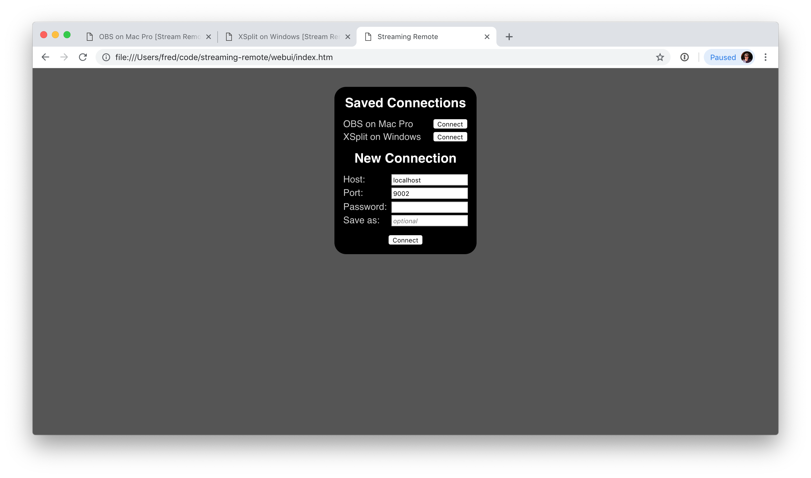
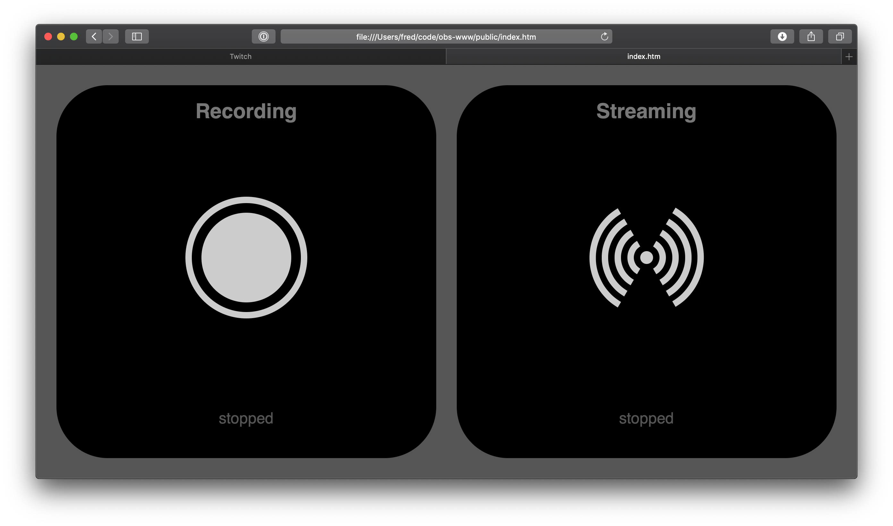
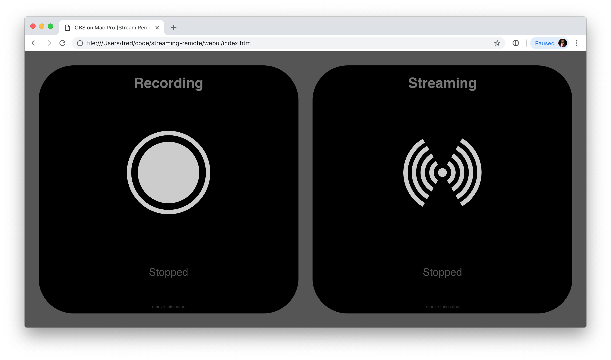

# Streaming Remote

Streaming Remote provides secure remote control of
[OBS Studio](https://obsproject.com) or [XSplit](https://www.xsplit.com) via TCP
sockets or WebSockets.

A StreamDeck plugin and basic Web UI are also provided.

## Installation

Download files from [the latest release](https://github.com/fredemmott/streaming-remote/releases/latest); most
users will want the the 'production' or 'Release' downloads, unless you have a specific reason not to.

### OBS Studio

1. Download the OBS studio plugin and extract it
2. Copy the `.dll` or `.so` to the `obs-plugins` sub-folder of your OBS studio installation
   - If you use 64-bit OBS for Windows, this is likely `C:\Program Files\obs-studio\obs-plugins\64bit`
   - If you use 32-bit OBS for Windows, this is likely `C:\Program Files\obs-studio\obs-plugins\32bit`
   - If you use OBS for MacOS, this is likely `/Applications/OBS.app/Contents/PlugIns`
   - If you installed OBS using homebrew, will need to build from source
3. Start OBS
4. Configure the plugin from "Streaming Remote Settings" in the Tools menu

### XSplit Broadcaster

1. Enable developer mode from Tools -> Settings -> Advanced
2. Restart XSplit when prompted
3. Download the XSplit plugin and extract it
4. Copy the `dll` to the `ScriptDlls\Local` subdirectory of your XSplit installation; this is likely
  `C:\Program Files (x86)\SplitmediaLabs\XSplit Broadcaster\x64\Scriptdlls\Local`
5. Select "Extensions" -> "Add extension" -> "Add extension file"
6. Use the "Browse" button to find the index.html file inside the plugin directory
7. Open "Tools" -> "Streaming Remote" to enable or configure; closing the window closes the plugin.

### Web UI

1. Download the Web UI and extract it
2. Open `index.html` in your favorite browser; Google Chrome is recommended

### StreamDeck plugin

1. Download the plugin and open it

## Web UI

The web UI is tested on Chrome and Safari; it is known not to work on Edge.

If local storage is available, the web UI will save connection settings; local
storage is not available when opening the index.html file directly in Safari,
but it works in Chrome.

### Connection Screen



### OBS




### XSplit


## Capabilities

- retrieve a list of outputs and states
- start an output (stream or recording)
- stop an output
- push notifications for output state changes
- software-agnostic: there are no protocol or client differences when using
  OBS vs XSplit
- modern security (authentication and encryption) via
  [libsodium](https://libsodium.org)

We expect to expand the capabilities in the future.


## Building Native Components From Source

### Requirements

- [CMake](https://cmake.org)
- [Qt5](https://www.qt.io)
  the web UI or the XSplit plugin
- [OBS Studio](https://obsproject.com) - built from source - if building the OBS plugin
- Visual Studio 2019 or recent XCode

### Instructions

```
streaming-remote$ mkdir build
streaming-remote$ cd build
build$ cmake .. \
  -DWITH_XSPLIT=ON \
  -DWITH_OBS_ON \
  -DOBS_SOURCE_DIR=/path/to/obs-studio \
  -DOBS_BUILD_DIR=/path/to/obs-studio/build
build$ make
```

The XSplit plugin can be built on all platforms, even though XSplit itself
is only available on Windows. This is useful when working on changes that
affect the `StreamingSoftware` class on a non-Windows machine.


1. Copy the DLLs for QtCore, QtNetwork, QtWebsockets, and sodium into the
   root directory of your XSplit installation - likely
   `C:\Program Files (x86)\StreamLabs\XSplit\x64\`
1. Inside the root directory, there is a `ScriptDlls` directory. Create a
   `Local` directory inside that path.
1.  Copy `xsplit-streaming-remote.dll` to the new `Local` directory
1.  You will need to enable developer mode in XSplit to run self-built DLLs
1. in XSplit, open the 'Extensions' menu, then 'Add Extension'; select the
   `plugins/xsplit/js/index.html` file


## Building TypeScript Components from source

### Requirements

- typescript
- yarn (preferred) or npm

### Instructions

1. in `js-client-lib`, run `yarn install && tsc`
2. in `xsplit-js-plugin`, `streamdeck-plugin`, and `webui`, run:
   `yarn install && yarn run webpack --mode production`

## Protocol

There are two message-based protocols:
- a binary [handshake protocol](handshake_protocol.md)
- an encrypted JSON-RPC-based [RPC protocol](rpc_protocol.md)

### Message Passing

For WebSockets, the standard binary mesage functions are used.

For TCP sockets, Unix sockets (MacOS, Linux), and named pipes (Windows), an ASCII `Content-Length: ` header is
sent containing the number of bytes, then CRLF CRLF, then the blob. The next Content-Length header
*immediately* follows the blob.


```
"Content-Length: 7\r\n"
"\r\n
"hello, Content-Length: 6\r\n"
"\r\n"
"world."
```

## License

The contents of this repository is [MIT-licensed](LICENSE).

Note that as the OBS plugin includes and links against
libobs and libobs-frontend-api &emdash; which are licensed under the GNU General
Public License version 2, or (at your option) any later version &emdash; the OBS
plugin as a whole (combined work) is under [the same license](LICENSE.OBS_COMBINED_WORK).
